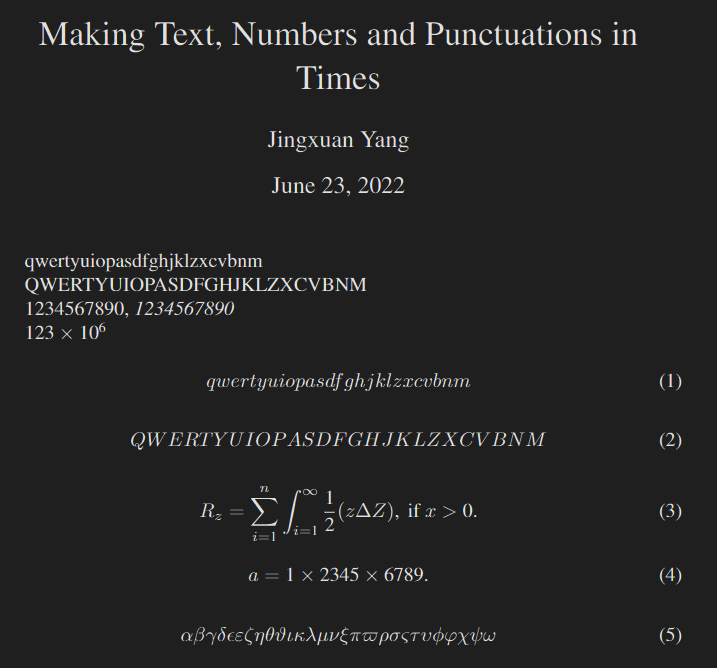

<!-- Author : Jingxuan Yang-->
<!-- Program Email: yanglatex2e@gmail.com -->

# tnptimes: Making Text, Numbers and Punctuations in Times

# tnptimes: 文字、数字和标点使用 Times 字体

# Introduction to tnptimes

The `tnptimes` is a package that uses Times font to display Text, Numbers and Punctuations (especially in math environment), while the other math symbols remain the default font (CM).

# tnptimes 简介

`tnptimes` 是一个宏包，其使用 Times 字体显示正文文本，数学环境中的数字与标点，并保留数学符号的默认字体，即CM字体。

# Quick start

Use this package simply by adding `\usepackage{tnptimes}` to the preamble. The `main.tex` is given as an example. 

# License

This material is subject to the [LATEX Project Public License 1.3c](https://ctan.org/license/lppl1.3) or any later version.

# 协议

本模板的发布遵照 [LATEX Project Public License 1.3c](https://ctan.org/license/lppl1.3) 协议或其后版本。

# References（参考文献）

* [LATEX2ε font selection](http://mirrors.ctan.org/macros/latex/base/fntguide.pdf)
* [LATEX font encodings](http://mirrors.ctan.org/macros/latex/base/encguide.pdf)
